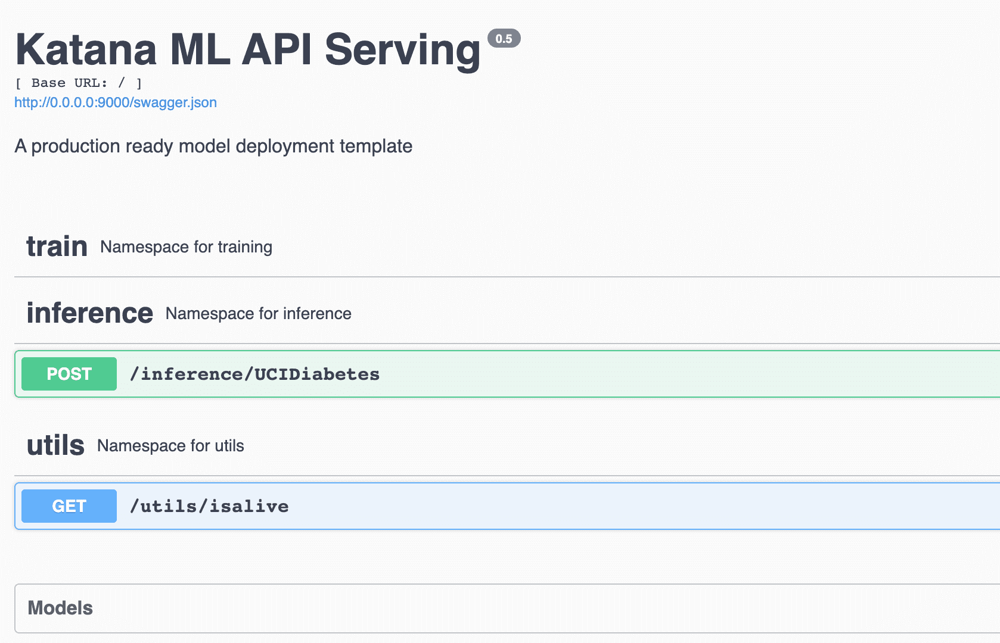

# ⚔️ Project Katana 
> Katana project is a pre-built bioler plate code for production level model deployement. 
> 
> Checkout demo at- https://katana-demo.herokuapp.com/


## Features 💫
1. Flask Restx at your rescue
2. Swagger UI and gunicorn integration
3. Docker ready configuration
4. Integrated GitHub actions
5. Almost ready deployement code 🚀



## Set-up Instructions 🕺
We recommend using flask default serving for development and gunicorn server for production deployment

We included following setup instructions;

1. Local development 
2. Docker supported deployement


### Local Development 👨🏻‍💻
1. Clone this repo with `git@github.com:shaz13/katana.git`
2. Set up environment using `python3 -m venv .env`
3. Activate envrionment using 
```
# Linux / Mac / Unix
$ source activate .env/bin/activate

# Windows
.\env\Scripts\activate
```
4. Install requirements using `pip install -r requirements.txt`
5. For debugging run from root - `python main.py`
6. Deploy using `Procfile` or `bash scripts/start.sh`
7. Your API is being served at `localhost:9000`

### Docker Setup ⛴
1. Clone this repo with `git@github.com:shaz13/katana.git`
2. Install docker in your system
3. Run `docker-compose up`
4. Your local port is mapped and being served at `localhost:9000`


## Contributors
1. Aditya Soni - @AdityaSoni19031997

## License
TDB